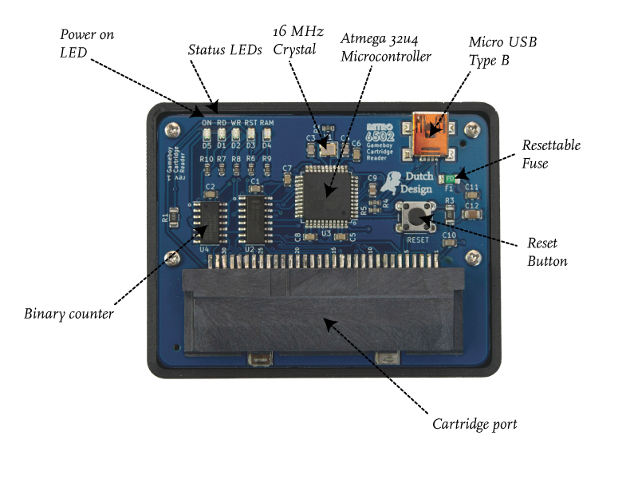

## Gameboy Cartridge Reader

The Gameboy Cartridge Reader is a GUI for interfacing with the Gameboy Cartridge Reader Board; a simple hardware tool to read and write to Gameboy and Gameboy Color Cartridges.

<i class="fa fa-file-download"></i> [Download the latest version from here](https://github.com/ifilot/gcr/releases/download/v.0.9.0/gcr_installer_win64_v0.9.0.zip).

### Gameboy Cartridge Reader

The Gameboy Cartridge Reader (GCR), is a program for interfacing with the Gameboy Cartridge Reader Board (GCRB), a USB device for retrieving data from Gameboy and Gameboy Color cartridges. Using this program and the board, you can

* Extract the ROM data from a gameboy cartridge and run the game in an emulator.
* Make a backup of your savegame and restore such a backup at a later stage. This also means copying your savegame to an emulator and putting it back on the cartridge.
* Flashing a writable cartridge (32kb only). This allows you to write your own game or program and try it out on actual hardware.

### Gameboy Cartridge Reader Board

The various components present on the GCRB are shown in the image below. The board uses a Atmega 32u4 microprocessor running at 16 MHz. You can connect the board to your computer using a Micro USB cable. The cartridge is slotted at the bottom in the cartridge port. When the board is powered via USB, the green LED at the left-top corner is on. The other status LEDs show you a visual indication on what the board is doing. Using a 12-bit binary counter, addresses can be put on the address bus and with the use of a few control lines, data can be fed or read from the Gameboy cartridge. You can communicate with the microprocessor using a serial interface which is visible on your computer as a virtual COM port. The GCR program shipped that accompanies the board sends instructions to the GCRB using a series of 8-byte commands and collects the response. This process is embedded in graphical user interface (GUI) allowing for easy and fast operation.

### Getting started

Detailed documentation on how to operate the GCRB is bundled with the GCR program. Simply hit F1 (or select 'Help Contents' from the 'Help' menu).

### Troubleshooting

**No serial port can be found**

This is a relatively complicated problem to debug. You can try a couple of things:
* Try a different USB port
* Try a different USB cable
* Ensure that the GCRB is connected directly to the computer and not via a USB hub

If the problem persists, please contact the vendor for a solution.

**The serial port is being recognized and displayed in Device Manager, yet I cannot interface with the GCR**

This problem has been identified for one of the insider builds of Windows. The solution is to set Windows 8 compatibility mode for GCR.exe which resolves the issue. (thanks to Donny for contributing to this solution)
