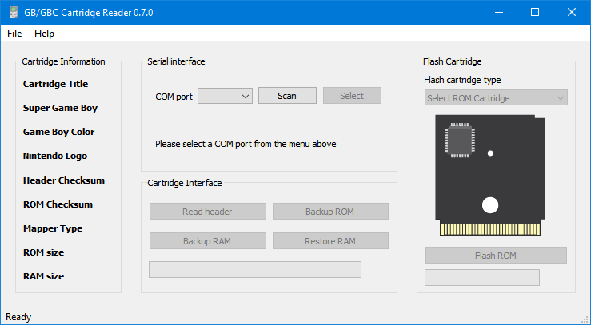
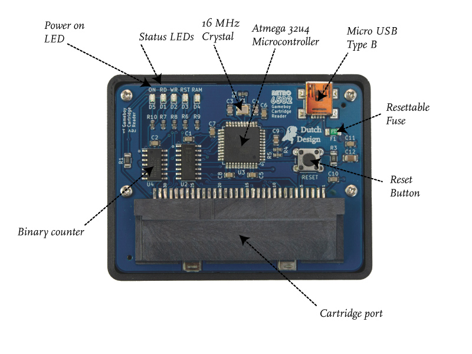

## Gameboy Cartridge Reader

The Gameboy Cartridge Reader is a GUI for interfacing with the Gameboy Cartridge Reader Board; a simple hardware tool to read and write to Gameboy and Gameboy Color Cartridges.

### Gameboy Cartridge Reader

### Gameboy Cartridge Reader Board

